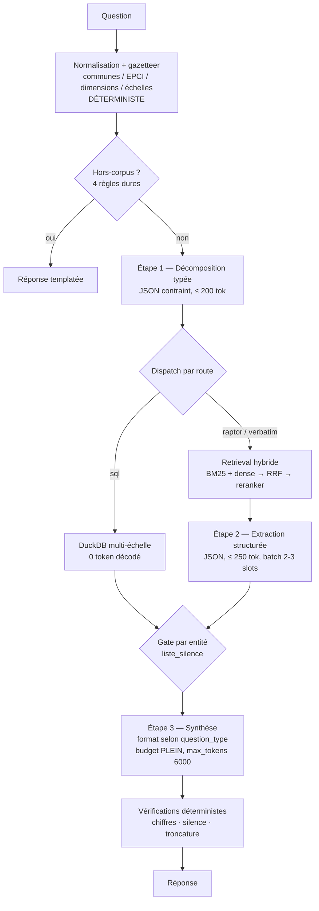

# BRIEF v2 — RAG Corse QdV en inférence locale

> Document unique. **Remplace `BRIEF_LOCAL.md` et les addenda 1 à 3**, qui peuvent être archivés.
> Chantier en 5 phases avec points d'arrêt. Ne pas enchaîner sans validation humaine.

---

## 1. Objectif

Porter le système RAG sur le bien-être des 360 communes corses vers des **modèles locaux**, pour raisons de confidentialité, sans perdre la qualité des réponses.

Le système doit continuer à gérer :
- la **différenciation des registres** — données quantitatives objectives vs perceptions qualitatives ;
- l'**agrégation multi-échelle** — Corse / département / EPCI / micro-région / commune ;
- des réponses **informatives et nuancées**, pas binaires.

Matériel cible : i7-13800H (14C/20T) · 32 Go DDR5 · **RTX 3000 Ada Laptop, 8 Go VRAM** · 532 Go libres.

Existant (à vérifier, la structure réelle peut différer de ce brief) :
- `rag_v10_raptor_subq.py` — pipeline de production en 3 étapes : décomposition → 5 sous-réponses → synthèse
- `rag_v9_raptor.py` — build de l'index RAPTOR (offline, actuellement via `mistral-small-latest`)
- `eval_from_excel.py` — évaluation, juge `score_judge_v43` (gpt-4o), 109 questions en 7 sections
- `./chroma_portrait` — ChromaDB, 3 208 documents, 14 collections, embeddings bge-m3

Référence de production : **~51 s par question**, ~4.65/5 au juge V4.3.

---

## 2. Diagnostic — pourquoi le portage local naïf a échoué

Un portage 1:1 de la v10 vers Qwen2.5-7B avait donné **~240 s par question**. Cause mécanique :

| Étape v10 | Tokens décodés | Coût @ 30 tok/s |
|---|---:|---:|
| Décomposition | 600 | 20 s |
| 5 × sous-réponses en prose | 4 000 | 133 s |
| Synthèse | 2 500 | 83 s |
| **Total** | **6 700** | **223 s** |

Les 240 s observées. **60 % du budget part dans 4 000 tokens de prose intermédiaire que seul le synthétiseur lit.**

Deux conclusions qui structurent tout le chantier :

1. **L'ennemi est le nombre de tokens décodés, pas le nombre d'étapes.** On conserve l'architecture en trois étapes ; on supprime la prose intermédiaire.
2. **Le mono-GPU n'interdit pas le parallélisme.** Le décodage est limité par la bande passante mémoire : avec `llama-server --parallel N` et *continuous batching*, les poids sont lus une fois par pas pour toutes les séquences actives. Gain agrégé attendu ×1,8 à ×2,5, à mesurer.

**Décision : décomposition et RAPTOR sont conservés.** Aucune mesure fiable ne montre d'avantage de l'architecture simple, y compris sur les questions de retrieval simple. La seule contre-indication établie concerne les questions sans données disponibles, traitée en phase 4.

---

## 3. Règles de travail

**Explorer avant d'écrire.** Produire d'abord une note de lecture : structure réelle du dépôt, points d'entrée, format des collections ChromaDB, schéma du fichier d'évaluation, emplacement des appels API. Signaler tous les écarts avec ce brief.

**Ne pas refactorer l'existant.** `rag_v10_raptor_subq.py` reste intact et sert de référence. Le nouveau code va dans `local/`, avec un point d'entrée `rag_v12_local.py`.

**Backend commutable.** Interface OpenAI-compatible avec `LLM_BACKEND=api|local`. Il doit être possible de faire tourner la même architecture sur les deux backends, pour séparer l'effet « modèle local » de l'effet « changement d'architecture ».

**Ne pas toucher** : ChromaDB, les embeddings, bge-m3, le schéma des collections, le corpus d'évaluation, la fonction de juge. Aucune ré-indexation avant la phase 5.

**Artefacts de run.** Chaque run produit un fichier horodaté : question, section, réponse, sources injectées, config, modèle, seed, température, latence par étape, scores. Température et seed fixés.

**Mesurer, ne pas supposer.** Tous les chiffres de performance de ce brief sont des estimations. Confirmer au `llama-bench` avant d'en tirer un arbitrage.

---

## 4. Architecture cible



### 4.1 Étape 1 — Décomposition typée

Sortie en **décodage contraint par schéma JSON** (GBNF ou `response_format`), plus de prose :

```json
{"question_type": "factuelle" | "faisabilite" | "existence",
 "action_verb": "comparer" | "evaluer" | "analyser" | null,
 "entites_cibles": ["Ajaccio", "Aiti"],
 "sub_questions": [
   {"q": "Score OppChoVec et rang d'Ajaccio",
    "registre": "quanti", "echelle": "commune",
    "entites": {"communes": ["Ajaccio"], "epci": [], "dimensions": []},
    "route": "sql"},
   {"q": "Perceptions de la santé exprimées à Ajaccio",
    "registre": "quali", "echelle": "commune",
    "entites": {"communes": ["Ajaccio"], "epci": [], "dimensions": ["sante"]},
    "route": "raptor"}
 ]}
```

`registre ∈ {quanti, quali}` · `echelle ∈ {corse, departement, epci, micro_region, commune}` · `route ∈ {sql, raptor, verbatim}`.

**Les règles du prompt actuel deviennent des post-conditions testées en Python, avec relance si violées :**
- si la question ne mentionne aucune commune, `entites.communes` doit être vide partout ;
- aucune sous-question ne peut croiser une métrique OppChoVec avec une ventilation démographique (âge, CSP, genre) — ces données n'existent pas ;
- question factuelle ⇒ toutes les sous-questions en `quanti` ;
- question de bien-être global ⇒ au moins un `quanti` et un `quali`.

Budget : **≤ 200 tokens** au lieu de 600.

#### `question_type` — préservation du niveau méta

Point critique, identifié par lecture des réponses. Sur les questions de faisabilité — *« Peut-on comparer le bien-être perçu à Ajaccio et à Aïti ? »* — le décomposeur convertit la question en sous-questions de contenu, le niveau méta disparaît du flux, et le synthétiseur, recevant des ingrédients de comparaison, produit une comparaison. Plus personne ne détient la question « est-ce possible ? ».

Contre-épreuve dans le corpus : *« Existe-t-il des données sur la mobilité douce dans le Niolu ? »* passe sans problème avec 5 sous-questions. Différence : pas de verbe d'action décomposable.

**Règle : quand `question_type != "factuelle"`, le synthétiseur doit rendre un verdict de faisabilité, pas exécuter l'action.** Les sous-réponses deviennent les pièces justificatives du verdict. Sélection du format **par le code**, jamais par consigne de prompt.

### 4.2 Étape 2 — Extraction structurée

Remplace les sous-réponses en prose (800 tokens) par de l'extraction (**≤ 250 tokens**), en JSON contraint :

```json
{"constats": [
   {"claim": "Accès à un médecin > 20 min signalé comme frein majeur",
    "entite": "Corte",
    "sources": ["raptor_summaries#412", "portrait_verbatims#88"],
    "n_effectif": 7, "confiance": "moyenne"}],
 "chiffres": [{"metric": "vec", "commune": "Corte", "valeur": 5.8, "rang": 142}],
 "lacunes": [{"entite": "Corte", "manque": "aucun verbatim santé pour les 18-24 ans"}]}
```

Justification : l'extraction est la tâche où un 9B est le plus proche d'un grand modèle ; la synthèse en prose nuancée est celle où l'écart est maximal. Le mode de défaite observé sur le 7B — « échantillonne les occurrences saillantes au lieu de compter » — est un échec de synthèse, pas d'extraction.

Les champs `entite` sont obligatoires : ils alimentent le gate du §4.4.

Exécuter en batch sur le nombre de slots déterminé en phase 0.

### 4.3 Étape 3 — Synthèse

**Budget entier conservé. `max_tokens = 6000`, pas 2500** — une troncature systémique a été identifiée sur l'ancien réglage, coupant les réponses en milieu de phrase.

Deux formats, sélectionnés par le code selon `question_type` :

**Format factuel** — squelette imposé :
1. Ce que disent les données objectives (échelle et rang explicites)
2. Ce que disent les données subjectives (effectifs explicites)
3. Convergences entre les deux registres
4. Divergences — **section obligatoire ; si aucune, l'écrire explicitement**
5. Limites : effectifs, données manquantes, nature de proxy des indicateurs
6. Ce que le corpus ne permet pas de conclure

**Format faisabilité** :
1. Verdict : opération possible / partiellement possible / impossible
2. Justification par entité : ce dont on dispose, ce qui manque
3. Si partiellement possible : ce qu'on peut légitimement dire, borné

Un petit modèle ne produit pas de nuance spontanément mais remplit bien un squelette. Les sections 3, 4 et 6 du format factuel sont précisément ce qui empêche les réponses binaires.

**Le titre et la première phrase ne sont pas générés librement** : ils sont composés par template à partir de `question_type` et du verdict. Motif : sur les cas observés, l'échec commence par un titre et une phrase d'ouverture qui affirment un résultat contredit par le corps de la réponse.

### 4.4 Gate par entité — règle de silence

```
pour chaque entité E de entites_cibles :
    si SQL(E) == ∅ et constats(E) == [] :
        E entre en liste_silence
```

Pour toute entité en `liste_silence`, la réponse ne peut contenir **aucun énoncé sur son état, y compris modalisé**. Interdits : « probablement », « peut-être », « on peut supposer », « semble ». Seul l'énoncé de l'absence est autorisé.

**Le gate est par entité, pas global.** Les cas d'échec observés ont des données abondantes sur une entité et rien sur l'autre — un ET global ne les attraperait pas.

Vérification post-génération en déterministe : découpage en phrases ; toute phrase mentionnant une entité de `liste_silence` sans marqueur d'absence est rejetée et relancée. Détection lexicale grossière mais suffisante — les cas observés emploient tous des modalisateurs standards.

Corollaire : **pas de tableau comparatif si une seule entité dispose de données.** Une colonne entièrement « Inconnu » signale que le tableau n'aurait pas dû être produit.

### 4.5 Détecteur hors-corpus déterministe

Quatre règles dures, avant tout appel LLM, réponse templatée :
- métrique OppChoVec **et** ventilation démographique demandée → donnée inexistante ;
- commune absente du gazetteer → hors périmètre ;
- comparaison avec une autre région → OppChoVec est une échelle 0–10 intra-Corse, non comparable ;
- `n_repondants < 3` sur la dimension demandée → caveat d'effectif obligatoire.

### 4.6 Retrieval hybride

- **Gazetteer déterministe** en amont : 360 communes avec variantes corses/françaises (*Aiacciu/Ajaccio*, *Portivechju/Porto-Vecchio*, *Corti/Corte*), 30 EPCI, 13 dimensions QdV et synonymes, tranches d'âge, CSP. Matching exact puis fuzzy (RapidFuzz, seuil ~88).
- **BM25** (`tantivy` ou `rank_bm25`, index mémoire sur 3 208 docs) en parallèle du dense bge-m3. Motif : corpus dense en noms propres corses et sigles (`OppChoVec`, `Opp`, `Cho`, `Vec`, codes EPCI) que l'embedding dilue.
- **Fusion RRF** (k=60), puis **reranker** `bge-reranker-v2-m3`, top-30 → top-7.
- **Injection d'effectifs** : chaque synthèse RAPTOR et chaque score arrive avec son `n` en champ structuré, pas noyé en prose.

### 4.7 Couche DuckDB multi-échelle

Matérialiser depuis les collections ChromaDB existantes, sans les modifier : `oppchovec_scores`, `enquete_scores_commune`, `communes_equipements`, `communes_profil`, `zones_epci`, `communes_geo`, plus une table de métadonnées des verbatims (`commune, age_range, profession, dimension`) permettant les comptages de fréquence.

Hiérarchie d'échelles : commune (360) → EPCI (30) → micro-région / pays → département (2A/2B) → Corse.

**Pas de text-to-SQL libre.** Le LLM émet un spec JSON validé contre un schéma, exécuté par du code :

```json
{"op": "top_k", "table": "oppchovec", "metric": "vec",
 "scale": "epci", "filters": {"epci": "Centre Corse"}, "k": 5, "order": "desc"}
```

`op ∈ {lookup, top_k, rank, compare, aggregate, count, distribution}`. Spec invalide → rejet et relance, jamais d'exécution partielle.

**Trois garde-fous méthodologiques, à coder :**

1. **Les rangs ne s'agrègent pas.** Le rang moyen des communes d'un EPCI sur 360 n'a pas de sens. `op=aggregate` sur un champ `rang_*` est rejeté par le validateur. On agrège le score, puis on recalcule un rang sur la population d'EPCI.
2. **Moyenne simple vs pondérée par population.** Avec Ajaccio et Bastia face à des communes de 50 habitants, l'écart est massif et peut inverser la conclusion. Calculer les deux, les injecter étiquetées, lever un flag pour le synthétiseur quand elles divergent au-delà d'un seuil à calibrer.
3. **Couverture explicite.** Toute agrégation retourne `{communes_couvertes, communes_totales, n_repondants}`, champ obligatoire dans le contexte de synthèse. Agréger 4 communes sur 21 et présenter le résultat comme « le Centre Corse » est une erreur que le système doit expliciter.

Cette couche traite aussi le comptage de fréquences sur les verbatims (le champ `dimension` est déjà en métadonnée), c'est-à-dire exactement ce qu'un petit modèle fait mal.

**GraphRAG reste hors périmètre.** Les relations nécessaires — appartenance EPCI, voisinage, similarité sur un vecteur de 4 dimensions — sont hiérarchiques et métriques, pas des chemins multi-sauts. Un `JOIN` et un k-NN sur les scores OppChoVec couvrent « communes similaires à Ajaccio » et « agrégation par intercommunalité » pour une fraction de l'effort.

### 4.8 Vérifications déterministes finales

- **Chiffres** : extraction par regex, vérification de présence dans les sources et résultats DuckDB injectés. Après la phase 2, tous les chiffres transitent par SQL — c'est un test d'intégrité.
- **Silence** : voir §4.4.
- **Troncature** : toute réponse finissant sans ponctuation terminale ou sur un balisage non fermé est signalée et relancée. À logger systématiquement.

---

## 5. Pile de modèles

| Rôle | Modèle | Format | Emplacement | Empreinte |
|---|---|---|---|---|
| Embedding requêtes | **bge-m3** *(inchangé)* | ONNX int8 | **CPU** | ~0.6 Go RAM, ~80 ms |
| Reranking | **bge-reranker-v2-m3** | ONNX int8 | **CPU** | ~0.6 Go RAM, ~2 s / 30 paires |
| Générateur | **Qwen3.5-9B** | GGUF Q4_K_M | **GPU** | ~5.4 Go + KV |
| Build RAPTOR (offline) | idem, ou 35B-A3B en MoE offload | | | nocturne |

**Embedder et reranker sur CPU.** Contre-intuitif, mais les 8 Go sont partagés avec l'affichage Windows, et le corpus est déjà indexé — on n'embedde qu'une requête à la fois. 80 ms sur 14 cœurs est invisible ; les 1,2 Go libérés vont au KV cache.

**Pas de 14B.** À Q4 il fait ~8,5 Go et déborde. Sur un pipeline RAG où le prefill domine, l'offloading partiel est bien pire que les 10–15 tok/s annoncés en décodage pur. **Règle binaire : soit tout tient en VRAM, soit c'est l'écroulement.** Ne pas descendre sous Q4_K_M non plus.

**Budget VRAM en mode nominal** : 5,4 (poids) + 0,4 (KV 8k en q8_0) + 0,4 (buffer) + 0,6–1,0 (bureau Windows) ≈ **6,8–7,2 Go**. Tient, sans confort. Mesurer l'occupation au repos au `nvidia-smi` et calibrer `--ctx-size` en conséquence.

**Serveur : `llama-server` (llama.cpp) avec CUDA, pas Ollama.** Nécessaire pour les grammaires GBNF / `response_format: json_schema`, `--parallel`, `--cache-reuse`, la quantification explicite du KV cache et `--n-cpu-moe`. Interface OpenAI-compatible dans les deux cas.

Vérifier la disponibilité du GGUF Qwen3.5-9B avant de s'engager ; repli documenté sur Qwen3-8B ou Qwen3.5-4B.

---

## 6. Budget de latence visé

| Étape | Tokens décodés | Temps |
|---|---:|---:|
| Normalisation + routage | 0 | 0,05 s |
| Décomposition typée | 200 | 7 s |
| Sous-questions SQL (2 sur 5) | 0 | 0,3 s |
| Extraction quali (3 sur 5), batch ×2 | 750 | 13 s |
| Reranking CPU (recouvert) | — | ~0 s |
| Synthèse | ~1 200 réels | 40 s |
| Vérifications | 0 | 0,02 s |
| **Total** | **~2 150** | **~60 s** |

Hors-corpus : < 0,1 s. Moyenne pondérée attendue : **~40 s**, contre ~51 s en production API et ~240 s pour le portage naïf.

---

## 7. Phases

### PHASE 0 — Socle et baseline *(~2 j)* 🛑

1. Note de lecture du dépôt (§3).
2. Installer `llama.cpp` avec CUDA. Charger Qwen3.5-9B Q4_K_M. Mesurer la VRAM au repos, calibrer `--ctx-size` et `-ctk/-ctv q8_0`.
3. **Benchmark de parallélisme** : balayer `--parallel 1 2 3 4` au `llama-bench`, mesurer le débit agrégé et par séquence. Documenter le nombre de slots réellement utilisable compte tenu du KV cache — chaque sous-question porte 4–6k de contexte, non partageable entre slots.
4. Basculer bge-m3 et le reranker sur CPU en ONNX int8.
5. Porter `rag_v10_raptor_subq.py` sur le backend local **sans changer l'architecture ni les prompts**, `max_tokens=6000` pour la synthèse.
6. Run complet sur les 109 questions.

**Livrable** : latence médiane et p90, décomposition par étape, taux de troncature, score par section. C'est la baseline locale.

### PHASE 1 — Réduction des tokens décodés *(~4 j)* 🛑

Décomposition typée (§4.1) et extraction structurée (§4.2). Synthèse inchangée à ce stade, budget plein.

**Critère d'acceptation : latence divisée par ~3, score par section stable.** Une baisse signale que l'extraction perd de l'information — remonter le budget d'extraction à 400 tokens et re-mesurer avant de conclure.

### PHASE 2 — Couche DuckDB et retrieval hybride *(~6 j)* 🛑

§4.6 et §4.7. Gazetteer, BM25 + RRF + reranker, tables DuckDB, spec JSON, les trois garde-fous méthodologiques.

**Critère** : les questions d'agrégation et de comptage doivent devenir exactes, vérifiables directement sans passer par le juge. Construire une dizaine de questions de contrôle à réponse connue (« combien de communes ont un score Vec inférieur à 3 ? ») et exiger 100 %.

### PHASE 3 — Faisabilité, silence, abstention *(~4 j)* 🛑

§4.1 (`question_type`), §4.3 (deux formats), §4.4 (gate par entité), §4.5 (hors-corpus), §4.8 (vérifications).

**Jeu de test minimal**, issu de la section *Gestion d'absence d'information* :
- *« Peut-on comparer le bien-être perçu à Ajaccio et à Aïti ? »* — doit rendre un verdict d'impossibilité, sans tableau, sans énoncé sur Aïti.
- *« Est-il possible de comparer les indicateurs objectifs et qualitatifs pour Pedicorte ? »* — idem, et sans interprétation des habitants à partir de moyennes corses.
- *« Les données permettent-elles d'analyser le bien-être des 18-25 ans à Lozzi ? »* — doit conserver le comportement actuel, qui est bon : verdict en tête, substitution étiquetée, séparation explicite de l'établi et de l'inconnu.
- *« Quel est le score OppChoVec de la commune de Nice ? »* — refus par gazetteer, sans appel LLM.

### PHASE 4 — Rebuild RAPTOR local *(1 nuit + ~2 j)* 🛑

`rag_v9_raptor.py` envoie aujourd'hui des verbatims groupés par commune × âge × CSP vers une API. Sur une commune corse de moins de 100 habitants, c'est ré-identifiable. **C'est la fuite de données la plus importante du système ; à traiter même si le reste du chantier s'arrête.**

- Basculer le build sur le backend local. ~670 synthèses × ~900 tokens à 30 tok/s ≈ 7–9 h, une nuit.
- Découper le format de synthèse en sections générées séparément avec schéma JSON contraint, plutôt qu'un unique format libre.
- **Finir l'indexation des entretiens** : `raptor_entretiens_summaries` contient 2 documents pour 284 extraits disponibles dans `portrait_entretiens`. Gisement de qualité le plus important non exploité ; coût marginal en local = du temps machine nocturne.
- Conserver une copie de `./chroma_portrait` pour l'A/B.

---

## 8. Sur l'évaluation

L'instrument a une résolution limitée : sur 109 questions, l'intervalle de confiance à 95 % pour un écart entre deux configurations est d'environ **±0.10**. Un gain global inférieur à ce seuil n'est pas mesurable par ce protocole.

Conséquence : **ne pas prendre « le score global a monté » comme critère d'acceptation d'une phase.** Utiliser à la place, par ordre de fiabilité :

1. **Les critères déterministes** — latence, taux de troncature, exactitude des agrégations, respect du gate de silence. Ce sont les seuls qui ne dépendent pas du juge, et ils couvrent l'essentiel des phases 1 à 3.
2. **Les jeux de test ciblés** — les quatre questions de la phase 3, vérifiées à la lecture.
3. **Le score par section**, en gardant à l'esprit qu'un n de 14 exige un effet d'environ ±0.27 pour être visible.
4. **Le score global**, en dernier, comme garde-fou contre une régression franche — pas comme mesure de progrès.

Note pour plus tard, hors périmètre de ce chantier : si tout doit être local, le juge aussi. `score_judge_v43` envoie les sources à gpt-4o, donc les verbatims sortent également par le canal d'évaluation. Les ~436 réponses déjà notées constituent un jeu de calibration pour un juge local.

---

## 9. Ce qu'il ne faut pas faire

- Enchaîner les phases sans validation humaine aux points 🛑.
- Refactorer `rag_v10_raptor_subq.py`, toucher à ChromaDB, bge-m3 ou au corpus d'évaluation.
- Supprimer la décomposition ou RAPTOR, ou réduire le budget de la synthèse finale.
- Laisser le synthétiseur décider seul du format ou du mode d'abstention : ces choix sont faits par le code.
- Faire du text-to-SQL libre.
- Descendre sous Q4_K_M, ou accepter un offload partiel de couches denses pour faire tenir un modèle plus gros.
- Reprendre les chiffres de performance de ce brief sans les avoir mesurés.
